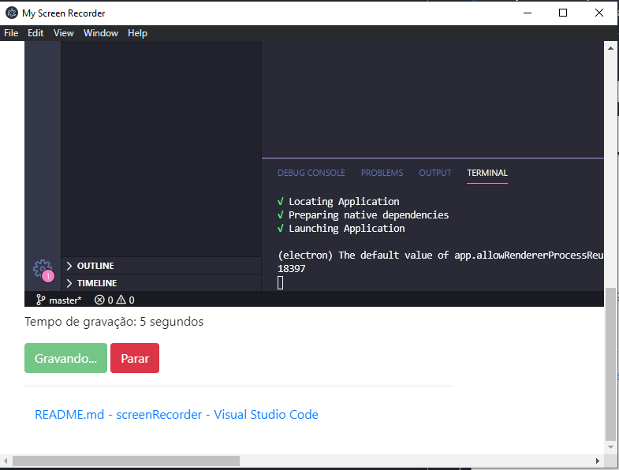

# My Screen Recorder #

- ### *Objetivo*: ###
> - Criar uma aplicação para gravação de telas

- ### *Como funciona*: ###
> - Ao abrir a aplicação o usuário tem a opção de escolher uma tela a qual deseja
gravar, ao selecionar a tela ele pode pressionar o botão de Iniciar para começar o processo de gravação. No centro da aplicação será exibido em tempo real a tela gravada e abaixo será mostrado com quanto tempo (em segundos) está o video. Ao clicar em parar, uma tela de salvamento será aberta para o usuário selecionar onde quer salvar o vídeo gravado.

- ### *Requisitos*: ###
> - Node v12.16.1 ou superior
> - Yarn 1.22.4 ou superior (pode ser substituído por NPM 6.13.4 ou superior)

- ### *Como usar*: ###
> - git clone https://github.com/robertosamuelx/screen-recorder.git
> - yarn add (ou npm i)
> - yarn start (ou npm start)

---

- ### **APRESENTAÇÃO** ###

